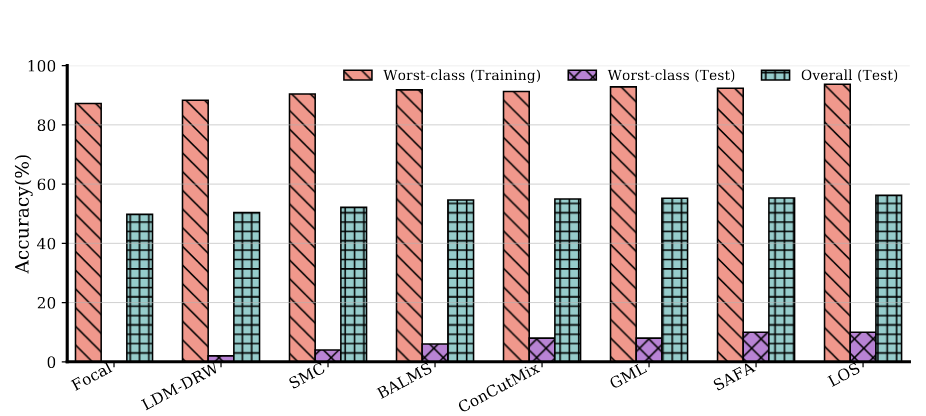

# CAR: Confusion-Aware Spectral Regularizer for Long-Tailed Recognition

> **[CVPR 2026 Oral]** Confusion-Aware Spectral Regularizer for Long-Tailed Recognition

## Abstract

Long-tailed image classification remains a long-standing challenge, as real-world data typically follow highly imbalanced distributions where a few head classes dominate and many tail classes contain only limited samples. This imbalance biases feature learning toward head categories and leads to significant degradation on rare classes. Although recent studies have proposed re-sampling, re-weighting, and decoupled learning strategies, the improvement on the most underrepresented classes still remains marginal compared with overall accuracy. In this work, we present a confusion-centric perspective for long-tailed recognition that explicitly focuses on worst-class generalization. We first establish a new theoretical framework of class-specific error analysis, which shows that the worst-class error can be tightly upper-bounded by the spectral norm of the frequency-weighted confusion matrix and a model-dependent complexity term. Guided by this insight, we propose the **C**onfusion-**A**ware Spectral **R**egularizer (**CAR**) that minimizes the spectral norm of the confusion matrix during training to reduce inter-class confusion and enhance tail-class generalization. To enable stable and efficient optimization, **CAR** integrates a Differentiable Confusion Matrix Surrogate and an EMA-based Confusion Estimator to maintain smooth and low-variance estimates across mini-batches. Extensive experiments across multiple long-tailed benchmarks demonstrate that **CAR** substantially improves both worst-class accuracy and overall performance. When combined with ConCutMix augmentation, **CAR** consistently surpasses existing state-of-the-art long-tailed learning methods under both the training-from-scratch setting (by **2.37% ~ 4.83%**) and the fine-tuning-from-pretrained setting (by **2.42% ~ 4.17%**) across **ImageNet-LT, CIFAR100-LT, and iNaturalist** datasets.

<p align="center">
  
</p>

## What is in this repository?

We provide the training code for our **CAR** and the baselines.

This repository includes:

- training code for **CAR**
- training code for baseline methods
- utilities for analysis and visualization

## Requirements

Please install the required packages with:


pip install -r requirements.txt

## Training


### Example: CIFAR100-LT-IF10 with ViT-S

Run the following command to train CAR with a ViT-S backbone on CIFAR100-LT-IF10:

```bash
CUDA_VISIBLE_DEVICES=0 python train_CSR_tail_weights.py \
  --train-dir /mnt/data/lsy/ZZQ/cifar100-LT-IF10/train \
  --val-dir /mnt/data/lsy/ZZQ/cifar100-LT-IF10/test \
  --model vit_small_patch16_224 \
  --img-size 224 \
  --batch-size 128 \
  --epochs 50 \
  --opt adamw \
  --lr 5e-5 \
  --weight-decay 0.05 \
  --no-pretrained \
  --init /data2/lsy/ZZQ/pretrained_weights/vit_small.bin \
  --sched cosine \
  --warmup-epochs 5 \
  --min-lr 1e-6 \
  --use-wj \
  --spec-lambda 0.3 \
  --spec-beta 0.5 \
  --spec-temp 1 \
  --hmt \
  --head-th 100 \
  --tail-th 20 \
  --save ckpt_tinyIN_IF100_vitS_differ_true_ema.pth \
  --wj-norm \
  --wj-min 1e-3 \
  --r0 0.5
